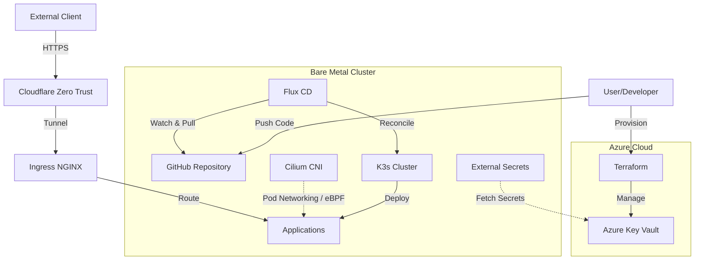

# 🏠 Homelab

**A GitOps-driven, Bare Metal Kubernetes cluster.**

This repository contains the Infrastructure as Code (IaC) and configuration for my personal homelab. It serves as a production-grade playground for exploring Cloud Native technologies, focusing on automation, security, and high availability.

## 📖 Introduction

The purpose of this homelab is twofold: continuous learning and full-stack responsibility.

As a recent Computer Science graduate passionate about Cloud Native technologies, this lab allows me to experiment with bleeding-edge tools and architectures (like eBPF with Cilium or GitOps with Flux) in a controlled environment to build deep technical expertise.

By self-hosting applications, I take ownership of the entire lifecycle—from hardware provisioning to application deployment, backup strategies, and observability.

## 🏗️ Architecture & GitOps Flow

I follow a strictly **Declarative** approach. If it's not in Git, it doesn't exist.



*   **Provisioning:**
    *   **Bare Metal:** I use **Ansible** to bootstrap the physical Debian nodes.
    *   **Cloud Infrastructure:** I use **Terraform** to manage Azure resources (Key Vault, Identities) as code, ensuring a reproducible hybrid environment.
*   **Orchestration:** **K3s** is my distribution of choice for its lightweight footprint.
*   **GitOps:** **Flux** monitors this repository and automatically reconciles the cluster state.

### ⚖️ Design Decisions

*   **Public vs. Private Architecture:** I utilize a multi-source GitOps strategy. This public repository manages the infrastructure and open-source stack, while a linked **Private Repository** handles sensitive workloads and personal data. Flux seamlessly reconciles both streams, allowing me to share my work publicly while keeping private data secure.
*   **Access Strategy:** I prioritize security and simplicity for service access:
    *   **Internal Access:** Services are accessible directly within the local network or remotely via **Tailscale**, which provides a secure Mesh VPN layer.
    *   **Public Access:** Specific services are exposed via **Cloudflare Zero Trust**, leveraging Cloudflare Authentication to ensure only authorized users can reach them without needing a traditional VPN.
*   **Bare Metal vs. Virtualization:** To maximize the performance of my hardware, I opted for a **Bare Metal** installation instead of using a virtualization layer like Proxmox. This avoids the overhead of an hypervisor, which is critical given the resources of my mini PCs, and ensures that the cluster remains performant for both experimentation and private services.

## 📂 Repository Structure

The repository mimics a standard enterprise monorepo structure, separating concerns between infrastructure, cluster definition, and applications.

```text
├── 📂 ansible/        # Ansible playbooks for OS provisioning and K3s installation
├── 📂 apps/           # Application manifests (Base, Staging, Production overlays)
├── 📂 clusters/       # Flux Cluster definitions (entry point for GitOps)
├── 📂 infrastructure/ # Infrastructure components (Ingress, Cert-Manager, Cilium)
└── 📂 monitoring/     # Observability stack (Prometheus, Grafana)
```

## 💻 Hardware

The cluster is composed of 3 **Dell Optiplex 7040 Micro** mini PCs. These units offer a perfect balance of performance and power efficiency for a 24/7 homelab environment.

| Node | Model | CPU | RAM | OS | Role |
| :--- | :--- | :--- | :--- | :--- | :--- |
| **k8s-cp** | Optiplex 7040 | i5-6600T | 16GB | Debian | Control Plane |
| **k8s-wp** | Optiplex 7040 | i5-6600T | 16GB | Debian | Worker (Primary Storage) |
| **k8s-ws** | Optiplex 7040 | i5-6600T | 16GB | Debian | Worker |

## 🚀 Technology Stack

This project leverages a modern Cloud Native stack to ensure performance, security, and observability.

### Cloud & Infrastructure as Code

| Logo | Technology | Purpose |
| :---: | :--- | :--- |
|  | [**Terraform**](https://www.terraform.io/) | **Infrastructure as Code.** Provisions and manages Azure resources (Key Vault, IAM) to ensure a reproducible cloud environment. |
|  | [**Microsoft Azure**](https://azure.microsoft.com/) | **Cloud Provider.** Hosts the Key Vault for secret management, integrating enterprise-grade security into the homelab. |
|  | [**Ansible**](https://www.ansible.com/) | **Configuration Management.** Automates the provisioning and hardening of the bare metal Debian servers. |

### Infrastructure & Networking

| Logo | Technology | Purpose |
| :---: | :--- | :--- |
|  | [**External Secrets**](https://external-secrets.io/) | **Secret Management.** Bridges the gap between Azure Key Vault and Kubernetes, syncing cloud secrets into the cluster securely. |
|  | [**Cilium**](https://cilium.io/) | **CNI & Security.** Uses eBPF for high-performance networking and L2 announcements. |
|  | [**Flux**](https://fluxcd.io/) | **GitOps.** Automates deployment and lifecycle management. |
|  | [**Ingress NGINX**](https://kubernetes.github.io/ingress-nginx/) | **Ingress Controller.** Handles internal HTTP/HTTPS routing. |
|  | [**Cloudflare Zero Trust**](https://www.cloudflare.com/products/zero-trust/) | **Security & Access.** Provides secure access to internal applications and the cluster without a VPN. |
|  | [**Cert-Manager**](https://cert-manager.io/) | **Security.** Automates issuance and renewal of Let's Encrypt SSL certificates. |
|  | [**ExternalDNS**](https://github.com/kubernetes-sigs/external-dns) | **DNS Automation.** Synchronizes exposed Kubernetes services and ingresses with DNS providers. |
|  | [**Pi-hole**](https://pi-hole.net/) | **Network DNS.** Runs in a Docker container outside K3s to ensure home internet stability during cluster maintenance. |

### Storage & Observability

| Logo | Technology | Purpose |
| :---: | :--- | :--- |
|  | [**Longhorn**](https://longhorn.io/) | **Distributed Block Storage.** Provides highly available persistent storage for stateful workloads. |
|  | [**Prometheus**](https://prometheus.io/) | **Metrics.** Scrapes and stores metrics from all cluster components. |
|  | [**Grafana**](https://grafana.com/) | **Visualization.** Dashboards for monitoring cluster health and performance. |
|  | [**Renovate**](https://renovatebot.com/) | **Automation.** Automatically creates Pull Requests to update dependencies. |

## 📱 Applications

| Logo | Application | Description |
| :---: | :--- | :--- |
|  | [**Portfolio**](https://dariomazza.net) | My personal developer portfolio and resume site. |
|  | **Homepage** | A modern, highly customizable dashboard for my homelab. |
|  | [**Vocard**](https://github.com/ChocoMeow/Vocard-Dashboard) | A feature-rich Discord music bot. Its microservices stack includes **Lavalink** for audio processing and **MongoDB** for data persistence. |

## ⚡ Bootstrap & Disaster Recovery

This cluster is designed to be fully reproducible. In case of a catastrophic failure, it can be rebuilt from scratch using the following steps.

1.  **Provision Hardware & K3s:**
    Using the Ansible playbooks located in `ansible/`, we install dependencies, harden the OS, and install K3s.
    ```bash
    ansible-galaxy install -r ansible/requirements.yml
    ansible-playbook -i ansible/inventory.ini ansible/site.yml
    ```

2.  **Bootstrap Flux:**
    Flux is installed on the cluster and pointed to this repository.
    ```bash
    flux bootstrap github \
      --owner=$GITHUB_USER \
      --repository=homelab \
      --path=clusters/main \
      --personal
    ```

3.  **Configure Secret Access:**
    The Azure Service Principal credentials must be manually added to the cluster to allow the External Secrets Operator to authenticate with Azure Key Vault.
    ```bash
    kubectl create secret generic azure-secret-sp \
      --namespace external-secrets \
      --from-literal=client-id=$AZURE_CLIENT_ID \
      --from-literal=client-secret=$AZURE_CLIENT_SECRET
    ```

---

*This project is constantly evolving. Feel free to explore the code to see how I handle specific challenges!*
